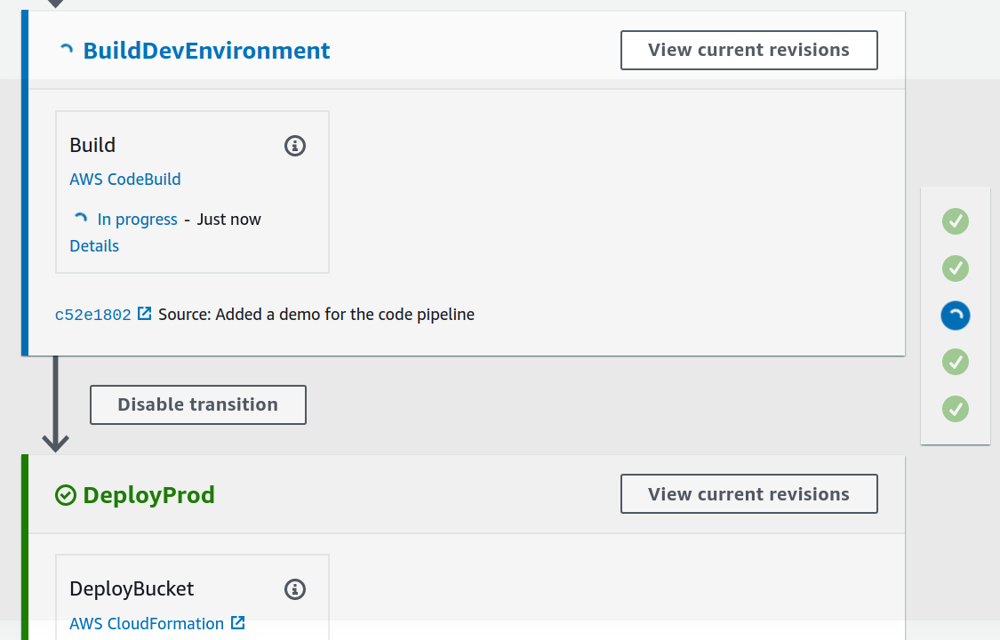
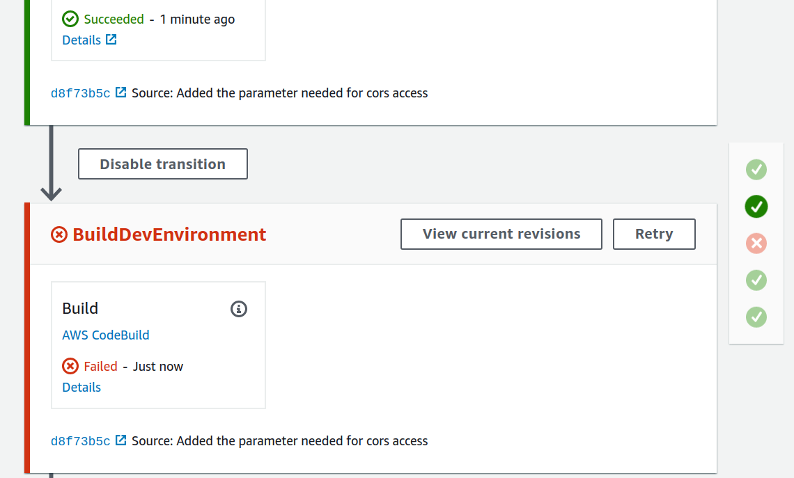
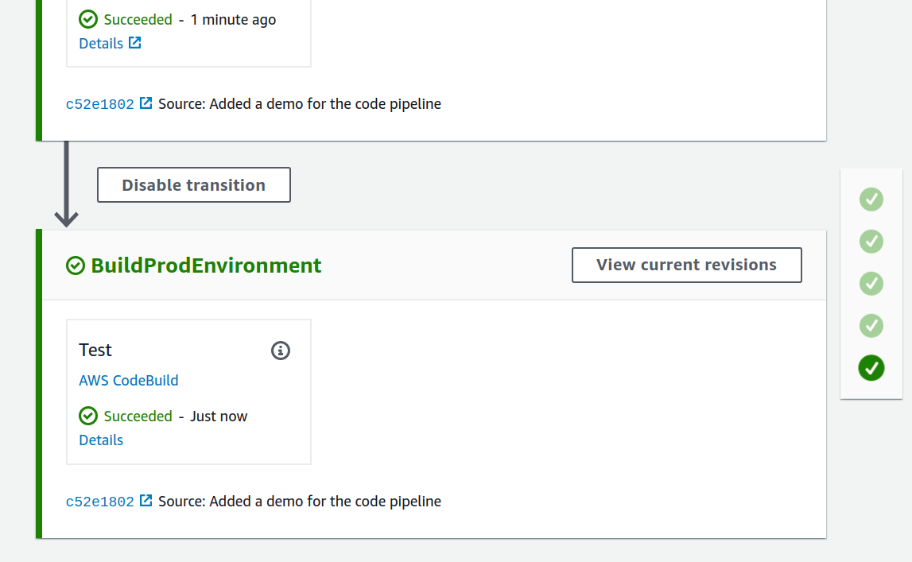

Serverless project for deploying markdown files to html web pages

### Code Pipeline Deployment process

Below is a high level description of the automated CI/CD pipeline:

1) When new code is pushed to the dev branch this triggers a code pipeline revision

2) Multiple cloudformation stacks will be spun up to enable a clean environment that replicates production


3) Any build errors that occur testing on this qa environment will halt the pipeline before any changes are made to production




4) Once all unit tests are passed the qa environment cloudformation stacks are deleted and the changes are migrated to production. Code Build tests are run on prod and once successfully passed the changes are merged into the master branch




### Development Tooling Overview
#### cfn-lint (cloudformation Linting)
[cfn-lint](https://github.com/aws-cloudformation/cfn-python-lint.git) Provides yaml/json cloudformation validation and checks for best practices

- Install

```
    pip install cfn-lint
```

- Run on a file
```
    cfn-lint <filename.yml>

    cfn-lint templates/code_pipeline.yml
```

- Run on all files in Directory
```
    cfn-lint templates/*.yml
```


#### Git Secrets Scan

[git secrets](https://github.com/awslabs/git-secrets.git) is a command line utility for validating that you do not have any git credentials stored in your git repo commit history

This is useful for not only open source projects, but also to make sure best practices are being followed with limited duration credentials (IAM roles) instead of long term access keys

- Global install

```
    git init

    git remote add origin https://github.com/awslabs/git-secrets.git

    git fetch origin

    git merge origin/master

    sudo make install
```

- Web Hook install

Configuring git secrets as a web hook will ensure that git secrets runs on every commit, scanning for credentials
```
    cd ~/Documents/devdocs

    git secrets --install

    git secrets --register-aws
```


- Run a git secrets check recursively on all files in directory

```
git secrets --scan -r .
```


### Project Directory Overview
Provides information on each directory/ source file

#### builds

##### py
    Directory for custom python scripts that setup build configuration
- buildspec_dev.yml = Buildspec to use for the development (QA)
    CodeBuild project

- buildspec_prod.yml = Buildspec to use for the prod deployment CodeBuild project

#### docs
Directory where markdown for new projects is placed.

The markdown in this directory will be built into html and
hosted as documentation. Markdown must comply with the following
structure:

```

├── docs
│   ├── v1
│   │   ├──project1_name
│   │   |   ├──project1_name.md    
│   ├── v1
│   │   ├──project2_name
│   │   |   ├──project2_name.md    
│   ├── v2
│   │   ├──project1_name
│   │   |   ├──project1_name.md   

```

Rules:
 - Each directory under docs must start with the character 'v'
 - 'v' must be followed by a numeric representing the version number of the documentation

 - Directory of project name must be under the version
 - Markdown file must match the name of the directory

Install and run documentation.js

[documentation.js github](https://github.com/documentationjs/documentation)
```
npm install -g documentation

#build all javascript files
documentation build static/js/** -f html -o docs/js

```

#### devops
- CI.sh = Establishes CodeCommit Repo and CodeBuild Project
    - For debugging errors go to the Phase details section of the console
    - Or use the batch-get-builds command in the aws cli

#### lambda

#### logs
- directory for python log files


#### templates


- code_pipeline.yml = Creates CodeBuild/Code Pipeline resources
    necessary for Dev/Prod

- static_webpage.yml = s3 bucket to be used by builds/buildspec_dev.yml
for static webhosting when testing in dev

#### tests

- test_dev_markdown_build.py = Ensures that folders in docs directory comply with build rules

- test_dev_aws_resources.py = after the dev environment is spun up in the CodeBuild project for builds/buildspec_dev.yml this script is run to validate deployment of resources.

If any of the test cases fail, the Pipeline stops before deploying to prod


- test_prod_aws_resources.py = test cases run after the prod environment is spun up in the CodeBuild project for builds/buildspec_prod.yml


#### Setup Continuous Integration
Run the devops/CI.sh shell script to create CodeCommit
Repo and CodeBuild Continuous Integration/Build client once

Create a Code Commit repository and add that repository as a remote

```
git init

git remote add origin <origin_url_or_ssh>

```


Fetch origin repo locally and merge if the remote

has any references you do not

```
    git fetch origin

    git merge origin/<branch_name>
```


#### Setup Infrastructure
